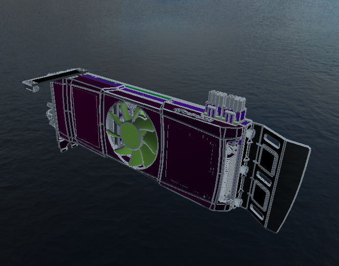

# GeometryProcessing

## 概要

Geometry Processing は、グラフィックスAPIや幾何学処理の学習をメインとしたPoCレベルの開発リポジトリです。

## 主要な開発

- Point Cloud ノード
  - コンピュートシェーダを用いた点群描画(.xyz)

- Half Edge ノード
  - BVH の構築
  - Shape Diameter Function
  - コンピュートシェーダを用いた Signed Distance Field の計算
  - Task Shader と MeshShader のテスト開発 

- CSF ノード
  - NVIDIAライブラリを用いたCSFファイルの可視化

- GLTF ノード
  - GLTFファイルの読込・アニメーション

- Volume ノード
  - XYZ軸方向の画像ベースの可視化
  - マーチンキューブ

- STEP ノード
  - STEPファイルの可視化（開発中）

## 使用技術

- 言語: C++
- 利用ライブラリ: 
[OpenGL](https://www.opengl.org/)
[Imgui](https://github.com/ocornut/imgui)
[nv_pro](https://github.com/nvpro-samples/nvpro_core)

## デモ

#### コンピュートシェーダを用いた点群描画

#### マウスピック

#### ボクセル化

#### Shape Diameter Function

#### メッシュシェーダとタスクシェーダのプロトタイプ実装の可視化

#### コンピュートシェーダを用いたポリゴンモデルのSigned Distance Field の計算

#### CSF　ローダー

#### GLTFファイルローダー

#### ボリュームビューイング

